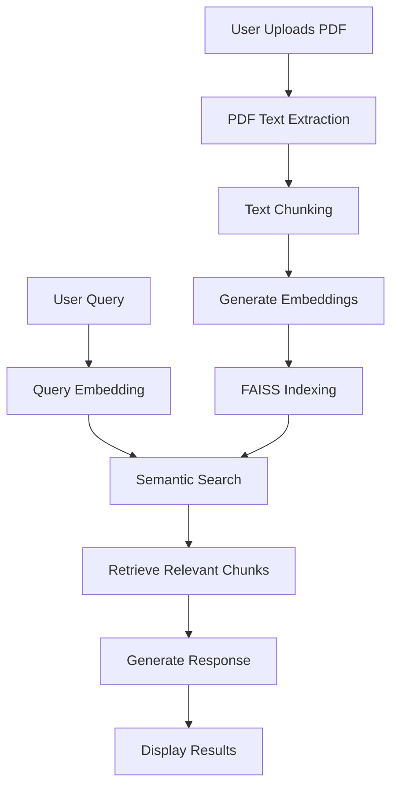
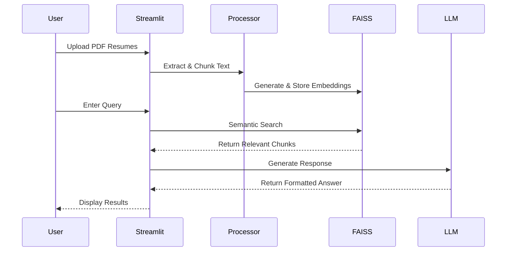
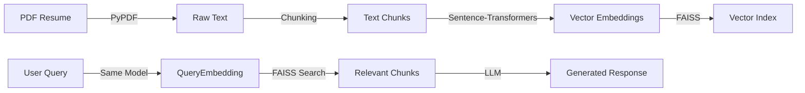

# 🔍 Offline Resume RAG Chatbot

**A privacy-first, locally-runnable chatbot for semantic search and Q&A on resumes using RAG architecture**

## 🚀 Project Overview

**Problem Solved**: Enables recruiters and hiring managers to efficiently search and extract information from resumes without relying on cloud services or exposing sensitive data.

**Why It Matters**: 
- 100% offline operation ensures complete data privacy
- Eliminates dependency on external APIs
- Provides accurate, context-aware search results

**Real-world Applications**:
- Recruitment agencies
- HR departments
- Hackathon judging
- Resume screening automation

## 🛠️ Tech Stack

| Category       | Technologies                                                                 |
|----------------|-----------------------------------------------------------------------------|
| **Language**   | Python 3.8+                                                                 |
| **Framework**  | Streamlit (Web UI)                                                          |
| **NLP**        | Hugging Face Transformers, Sentence-Transformers                            |
| **Vector DB**  | FAISS (Facebook AI Similarity Search)                                       |
| **PDF Parsing**| PyPDF                                                                       |
| **Persistence**| Pickle (for document store)                                                 |

## 🏗️ System Architecture



## ✨ Core Features

1. **Offline Processing**
   - No API keys or internet required
   - Local model inference
   - Complete data privacy

2. **Smart Chunking**
   - Context-aware text splitting
   - Configurable chunk size and overlap
   - Metadata preservation

3. **Semantic Search**
   - FAISS-based similarity search
   - Contextual understanding of queries
   - Multiple resume support

4. **Local LLM Integration**
   - Uses `facebook/opt-125m` model
   - Privacy-focused generation
   - Customizable prompt engineering

## 🔄 Workflow Pipeline



## 📊 Visual Insights

### Data Flow


## 🚀 Installation & Setup

### Prerequisites
- Python 3.8+
- pip (Python package manager)

### Steps
1. Clone the repository:
   ```bash
   git clone https://github.com/TecqHarishKrish/Offline-Resume-Rag-chatbot.git
   cd Offline-Resume-Rag-chatbot
   ```

2. Create and activate virtual environment:
   ```bash
   python -m venv venv
   source venv/bin/activate  # On Windows: venv\Scripts\activate
   ```

3. Install dependencies:
   ```bash
   pip install -r requirements.txt
   ```

4. Run the application:
   ```bash
   streamlit run app.py
   ```

## 💻 Usage Examples

### 1. Start the Application
```bash
streamlit run app.py
```

### 2. Upload Resumes
- Click "Browse files" to upload PDF resumes
- Wait for processing to complete

### 3. Query the System
Example queries:
- "Show candidates with Python experience"
- "Find resumes with machine learning skills"
- "List candidates with cloud certifications"

### 4. View Results
- Relevant resume sections are displayed
- Sources are clearly cited
- Raw context is available for verification

## 📁 Folder Structure

```
Offline-Resume-Rag-chatbot/
├── app.py                # Main application
├── requirements.txt      # Dependencies
├── README.md             # This file
├── faiss_index.bin       # Generated FAISS index
└── doc_store.pkl         # Document metadata store
```

## 📊 Results / Outputs

The application provides:
- Clean, formatted responses to natural language queries
- Source attribution for all information
- Confidence scores for search results
- Option to view full context

## 🚀 Future Enhancements

### Performance
- [ ] Optimize embedding model size
- [ ] Add batch processing for large resume volumes
- [ ] Implement caching for faster searches

### Features
- [ ] Support for additional document formats (DOCX, TXT)
- [ ] Customizable chunking strategies
- [ ] Advanced filtering options
- [ ] Multi-language support

### UI/UX
- [ ] Dashboard with search analytics
- [ ] Resume comparison view
- [ ] Export functionality for search results

## 🤝 Contribution Guidelines

1. Fork the repository
2. Create a feature branch (`git checkout -b feature/AmazingFeature`)
3. Commit your changes (`git commit -m 'Add some AmazingFeature'`)
4. Push to the branch (`git push origin feature/AmazingFeature`)
5. Open a Pull Request

Please ensure your code follows PEP 8 style guidelines and includes appropriate documentation.

## 👨‍💻 Author & Credits

- **Harish Krish** - [@TecqHarishKrish](https://github.com/TecqHarishKrish)

## 📄 License

This project is licensed under the MIT License - see the [LICENSE](LICENSE) file for details.

---

<div align="center">
  Made with ❤️ and 🤖 by the open-source community
</div>
